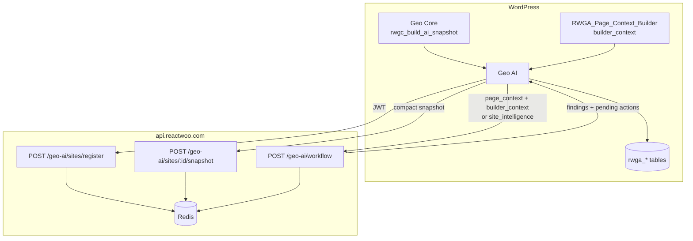

# Geo AI Intelligence Platform v3 — Architecture Audit

**Phase 1 repository audit** — documents what exists today across the Geo suite and API, and maps it to the v3 intelligence-platform vision.

**Audit date:** 2026-06-11  
**Repos inspected:** `reactwoo-geocore`, `reactwoo-geocore-pro`, `reactwoo-geo-ai`, `reactwoo-geo-optimise`, `reactwoo-geo-commerce`, `reactwoo-api`, `react-cloud`, `geo-elementor` (legacy bridge)

**Related (prior work):**

| Document | Location |
|----------|----------|
| Intelligence layer plan (phases 1–14 shipped) | `reactwoo-api/docs/PLAN-GEO-AI-INTELLIGENCE.md` |
| WordPress intelligence layer | `docs/GEO-AI-INTELLIGENCE.md` |
| Site snapshot contract | `reactwoo-geocore/docs/GEO-AI-SNAPSHOT.md` |
| API environment | `reactwoo-api/docs/GEO-AI-ENV-VARS.md` |
| Builder-aware page analysis | `PLAN.md` |

---

## Vision (v3)

Geo AI is an **intelligence platform** — not an AI copy generator. The correct architecture:

```text
Website
  ↓
Local Intelligence Layer
  ↓
Cloud Intelligence Layer
  ↓
Relationship Graph
  ↓
UX Knowledge Layer
  ↓
Premium AI Reasoning
  ↓
Recommendations
```

AI should consume **intelligence**, not raw websites.

---

## Current architecture (as shipped)

### Layer map

| Layer | Status | Primary implementation |
|-------|--------|------------------------|
| **Site config snapshot** | Shipped | Geo Core `RWGC_AI_Snapshot_Builder` → Redis via API |
| **Page builder parsing (local)** | Partial (v0.4.78) | Geo AI `includes/builders/` — structure, not persuasion |
| **Cloud intelligence workflows** | Shipped | API `geoAiIntelligenceWorkflow.ts` + LLM wrapper |
| **Relationship graph** | Shipped (config) | API `geoAiIntelligenceStore.ts` from snapshot |
| **UX page workflows** | Shipped | API `geoAiWorkflow.ts` — OpenAI `gpt-4o-mini` |
| **Approval-gated actions** | Shipped | `rwga_intelligence_actions` table |
| **Local intelligence tables (v3)** | **Not started** | — |
| **Messaging / UX / Visual engines (v3)** | **Not started** | — |
| **UX knowledge graph (v3)** | **Not started** | — |
| **Premium model routing (v3)** | **Not started** | All UX + intel use budget models today |
| **Insight memory cache (v3)** | Partial | API Redis cache for intelligence only |
| **Intelligence Centre admin (v3)** | Partial | Cloud intelligence + wizard; no payload inspector |

### Data flow today



**react-cloud** does not participate in Geo AI intelligence today. Google OAuth, Ads, and GA4 live there for GeoCore Pro; no `geo_ai:*` keys or intelligence routes.

---

## Repository inventory

### reactwoo-geocore

| Area | Class / API | Notes |
|------|-------------|-------|
| Site snapshot | `RWGC_AI_Snapshot_Builder`, `RWGC_AI_Snapshot_Schema` | Config metadata only; schema v1 |
| Public API | `rwgc_build_ai_snapshot()`, `rwgc_get_ai_snapshot_hash()` | Filter: `rwgc_ai_snapshot_payload` |
| Relationships | `collect_relationships()` | Variant ↔ rule ↔ popup edges |
| Variant draft bridge | `RWGC_Experience_Workflow`, REST | Phase 5 — Core bridge; Geo AI owns product UX |
| AI module | `includes/ai/` | Snapshot builder; not page intelligence |

**Does not include:** page messaging, UX persuasion scores, visual emphasis, or per-page intelligence tables.

### reactwoo-geocore-pro

| Area | Class | Notes |
|------|-------|-------|
| Snapshot enrichment | `RWGCP_AI_Snapshot` | `geocore_pro` block: profiles, Google entities, weather, providers |
| Targeting edges | `rwgc_ai_snapshot_relationships` filter | rule → campaign/audience |

### reactwoo-geo-ai (v0.4.78)

| Area | Class / table | Notes |
|------|---------------|-------|
| Cloud sync | `RWGA_Site_Intelligence_Sync`, `RWGA_Site_Snapshot_Client` | 15-min cron; hash skip |
| Intelligence workflows | `RWGA_Workflow_Intelligence` (8 keys) | Remote-only |
| UX workflows | `RWGA_Workflow_UX_Analysis`, `RWGA_Workflow_UX_Recommend` | Local stub + remote |
| Page context | `RWGA_Page_Context`, `RWGA_Page_Context_Builder` | Builder-aware since 0.4.78 |
| Builder adapters | `RWGA_Elementor_Adapter`, `RWGA_Gutenberg_Adapter` | Local `_elementor_data` parse; never sent raw |
| Structure scoring | `RWGA_Section_Classifier`, `RWGA_UX_Structure_Scorer` | Deterministic; hero/CTA/trust scores |
| Actions | `RWGA_DB_Intelligence_Actions`, `RWGA_Intelligence_Action_Applier` | 3 allowlisted types |
| Memory | `RWGA_Memory_Service` → `rwga_memory_events` | Event timeline; not insight reuse |
| Analysis storage | `rwga_analysis_runs`, `rwga_analysis_findings`, `rwga_recommendations` | Per-run UX audit rows |
| Cloud admin | `RWGA_Intelligence_Cloud_Client` | Runs list, graph, run detail |
| Wizard | `RWGA_Site_Intelligence_Journey` | Guided sync + audit |

**Missing vs v3:** `RWGA_Local_Intelligence`, `rwga_site_context`, `rwga_page_context`, `rwga_entity_context`, `rwga_ux_insights`, `rwga_ai_runs`, expanded intelligence actions, `RWGA_Context_Builder`, `RWGA_Model_Router`, Intelligence Centre.

### reactwoo-geo-optimise

| Area | Class | Notes |
|------|-------|-------|
| Snapshot block | `RWGO_AI_Snapshot` | `geo_optimise` experiments in cloud snapshot |
| Graph edges | experiment → page | Via `rwgc_ai_snapshot_relationships` |
| Handoff | Consumes `rwgo_prefill_*` from Geo AI | Create Test prefill only |

### reactwoo-geo-commerce

| Area | Class | Notes |
|------|-------|-------|
| Snapshot block | `RWGCM_AI_Snapshot` | `geo_commerce` rules; no order PII |
| Graph edges | commerce_rule → product | Via relationships filter |

### reactwoo-api

| Route group | File | Purpose |
|-------------|------|---------|
| `POST /api/v5/geo-ai/workflow` | `src/routes/geoAiWorkflow.ts` | UX + intelligence workflows |
| `POST /api/v5/geo-ai/sites/register` | `src/routes/geoAiSites.ts` | Site registration |
| `POST /api/v5/geo-ai/sites/:id/snapshot` | `src/routes/geoAiSites.ts` | Snapshot upload |
| `GET …/intelligence/runs` | `src/routes/geoAiIntelligence.ts` | Run history |
| `GET …/intelligence/graph` | `src/routes/geoAiIntelligence.ts` | Relationship graph |
| `POST /api/v5/ai/geo-variant-draft` | `src/routes/ai/geoVariantDraft.ts` | Core variant draft (separate from intelligence) |

| Service | File | Purpose |
|---------|------|---------|
| Site store | `geoAiSiteStore.ts` | Redis site + snapshot |
| Intelligence store | `geoAiIntelligenceStore.ts` | Runs + graph builder |
| Intelligence runner | `geoAiIntelligenceWorkflow.ts` | Deterministic fallback |
| Intelligence LLM | `geoAiIntelligenceLlm.ts` | Claude/OpenAI for intel workflows |
| Cost controls | `geoAiCostControls.ts` | Rate limits, quotas, intel cache |
| Builder prompts | `builderContextPrompt.ts` | Format `builder_context` for UX prompts |
| Workflow registry | `geoAiWorkflowRegistry.ts` | Tier + token budget per key |

### geo-elementor (legacy)

| Area | Status |
|------|--------|
| Geo Core bridge | `EGP_Geocore_Bridge` — deprecated; legacy licence → advanced targeting |
| AI / intelligence | **None** — targeting and Elementor document rules only |
| Content extraction | **None** — Geo AI `RWGA_Elementor_Adapter` reads `_elementor_data` directly |

Geo Elementor is **not** on the intelligence path. City targeting, popups, and document geo visibility are separate from Geo AI v3.

### react-cloud

No Geo AI routes, snapshots, or intelligence storage. Scoped to Google Geo integrations for GeoCore Pro.

---

## Existing workflows

### Intelligence workflows (site-wide, cloud)

| Key | Engine | Model (when LLM on) |
|-----|--------|---------------------|
| `site_audit` | LLM or deterministic | Claude Haiku / gpt-4o-mini |
| `rule_explain` | LLM or deterministic | Same |
| `rule_debug` | LLM or deterministic | Same |
| `rule_create` | LLM or deterministic | Same |
| `popup_fire_debug` | LLM or deterministic | Same |
| `variant_relationship_audit` | LLM or deterministic | Same |
| `tracking_gap_audit` | LLM or deterministic | Same |
| `optimisation_recommendation` | LLM or deterministic | Same |

Payload: `payload.site_intelligence` (compact snapshot subset or full snapshot).

### UX workflows (page-scoped)

| Key | Engine | Model |
|-----|--------|-------|
| `ux_analysis` | OpenAI only | `gpt-4o-mini` (hardcoded) |
| `ux_recommend` | OpenAI only | `gpt-4o-mini` (hardcoded) |
| `competitor_research` | OpenAI only | `gpt-4o-mini` (hardcoded) |

Payload: `page_context`, `reading_context`, `builder_context` (compact), `analysis_focus`.

### WordPress-only workflows

| Key | Notes |
|-----|-------|
| `copy_implement` | Implementation drafts |
| `seo_implement` | SEO drafts |
| Local stubs when engine = `local` | Bounded fake output for UX workflows |

---

## Existing caches

| Location | Key pattern | TTL | Scope |
|----------|-------------|-----|-------|
| API Redis | `geo_ai_site:{siteId}` | 90d | Site registration |
| API Redis | `geo_ai_snapshot:{siteId}:{hash}` | 90d | Snapshot payload |
| API Redis | `geo_ai_intel_run:{runId}` | 90d | Intelligence run result |
| API Redis | Intelligence cache via `buildIntelligenceCacheKey()` | 24h default | `{workflow}:{snapshot_hash}[:entity ids]` |
| WordPress | `input_hash` on `rwga_analysis_runs` | — | Stored; **no automatic reuse gate** on UX runs |
| WordPress | Snapshot hash skip on sync | — | Skip upload if unchanged |
| WordPress | JWT / usage caches | Transient | License only |

**Not implemented:** `workflow_key + snapshot_hash + entity_hash + prompt_version + model_version` insight memory (v3 Phase 14).

---

## Gap analysis (v3 vs today)

### Critical gaps (block differentiation)

| v3 capability | Current state | Gap severity |
|---------------|---------------|--------------|
| **Local Intelligence Layer** (`RWGA_Local_Intelligence`) | Builder parse + structure scores only; no persisted insights | High |
| **Messaging intelligence** (promise, UVP, objections, clarity) | Not extracted; UX prompts infer from trimmed widget text | High |
| **UX intelligence** (hierarchy, CTA effectiveness, friction, mobile) | `RWGA_UX_Structure_Scorer` covers structure only, not persuasion | High |
| **Visual emphasis intelligence** | Not implemented | High |
| **Context builder** (workflow-specific intelligence bundle) | Ad-hoc per workflow; no `RWGA_Context_Builder` | High |
| **Premium model routing** | All UX workflows use `gpt-4o-mini`; intel uses Haiku/mini | High |
| **Insight memory / reuse** | API intel cache only; no local `rwga_ai_runs` or UX insight cache | Medium |
| **UX knowledge graph** (anonymous cross-site learnings) | Not implemented | High (moat) |
| **Intelligence Centre** (local + cloud + AI + payload inspector) | Partial admin screens | Medium |

### Partial / foundation exists

| v3 capability | Foundation |
|---------------|------------|
| Relationship graph | API graph from snapshot; wizard + cloud admin UI |
| Cloud snapshot | Geo Core + satellite blocks; Redis store |
| Approval-gated actions | `rwga_intelligence_actions` with 3 types |
| Payload minimisation | Snapshot excludes content; `builder_context` compact |
| Elementor / Gutenberg parsing | `RWGA_Elementor_Adapter`, `RWGA_Gutenberg_Adapter` |
| Deterministic structure scoring | `RWGA_UX_Structure_Scorer`, `RWGA_Section_Classifier` |
| Site intelligence sync | Full pipeline shipped |
| Geo Optimise handoff | Prefill Create Test from intelligence runs |

### Correctly excluded today (keep)

- Raw Elementor JSON to API (by default)
- HTML bodies, orders, customers, emails in cloud payloads
- Frontend rendering dependency on AI
- Direct AI → WordPress mutation

### Recommended implementation order (post-audit)

1. **Phase 2** — DB schema + `RWGA_Local_Intelligence` orchestrator (site/page/entity context tables)
2. **Phases 3–5** — Messaging, UX insight, visual analyzers (deterministic first, then AI on summaries)
3. **Phase 6–7** — Refactor builder adapters into context extractors (meaning, not inventory)
4. **Phase 8** — Extend relationship graph with page-level edges locally
5. **Phase 11–12** — `RWGA_Context_Builder` + payload strategy enforcement
6. **Phase 13–14** — `RWGA_Model_Router` + insight memory
7. **Phase 9** — UX knowledge graph (API-side, anonymous only)
8. **Phase 16** — Intelligence Centre admin

---

## Success criteria checklist (v3)

| Criterion | Today |
|-----------|-------|
| Audit pages without sending raw builder data | **Yes** (compact `builder_context`) |
| Understand messaging, persuasion, psychology | **No** (model infers ad hoc) |
| Understand localisation and audience intent | **Partial** (geo_target in workflows; no maturity model) |
| Recommend experiments | **Partial** (optimisation handoff to Geo Optimise) |
| Recommend targeting improvements | **Partial** (rule/popup debug workflows) |
| Explain conversion issues | **Partial** (UX analysis findings) |
| Reuse intelligence and insights | **No** (per-run; intel API cache only) |
| Low cost via caching | **Partial** (intel cache; UX always calls model) |
| Consultant-quality recommendations | **Limited** (budget models, thin context) |
| Proprietary UX knowledge graph | **No** |

---

## Next steps

Proceed to **Phase 2** only after sign-off on this audit. Implementation docs:

- `docs/AI-PAYLOAD-STRATEGY.md`
- `docs/AI-UX-INSIGHT-CONTRACT.md`
- `docs/AI-KNOWLEDGE-GRAPH.md`
- `docs/AI-MODEL-ROUTING.md`
