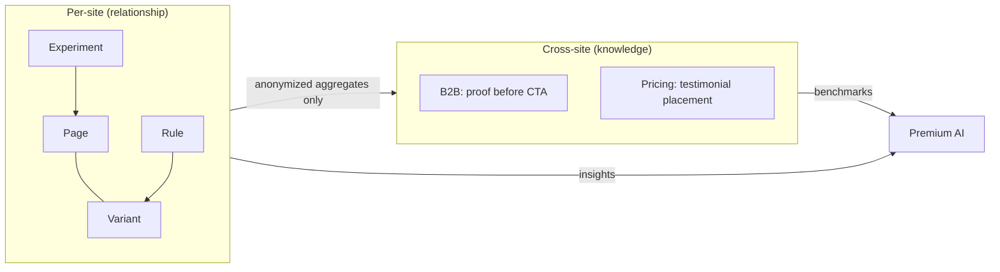

# Geo AI — Knowledge & Relationship Graphs

**Phase 1 audit** — relationship graph (shipped), UX knowledge graph (planned), and how they differ.

---

## Two graph types

| Graph | Scope | Data | Moat value |
|-------|-------|------|------------|
| **Relationship graph** | Per-site | Config links (rules, variants, popups, experiments) | Operational — debug targeting |
| **UX knowledge graph** | Cross-site, anonymous | Conversion patterns, CTA trends, industry benchmarks | Strategic — proprietary ReactWoo intelligence |

---

## Relationship graph (shipped)

### Purpose

Understand how geo configuration entities connect on a **single site** — not page persuasion.

### Implementation

| Layer | Location |
|-------|----------|
| Snapshot edges | Geo Core `collect_relationships()` + filters |
| Pro targeting edges | `RWGCP_AI_Snapshot` → `rwgc_ai_snapshot_relationships` |
| Optimise edges | `RWGO_AI_Snapshot` → experiment → page |
| Commerce edges | `RWGCM_AI_Snapshot` → commerce_rule → product |
| Cloud graph builder | `geoAiIntelligenceStore.ts` → `buildRelationshipGraph()` |
| API route | `GET /api/v5/geo-ai/sites/:siteId/intelligence/graph` |
| WordPress UI | Geo AI → Cloud intelligence |

### Node types (API v0.1.45+)

```text
rule, variant, popup, page, campaign, audience, profile,
experiment, commerce_rule, product
```

### Edge types

```text
targets, tests, targets_campaign, targets_audience, ...
```

### Example tree (conceptual)

```text
Page (master)
├── Variant (US)
├── Variant (UK)
├── Rule → targets → Variant
├── Popup → fires_on → Rule
├── Experiment → tests → Page
├── Commerce Rule → targets → Product
└── Tracking Events (via snapshot slugs)
```

### Graph response shape

```json
{
  "schema_version": 1,
  "snapshot_hash": "sha256...",
  "nodes": [{ "id": "rule:12", "type": "rule", "label": "US visitors" }],
  "edges": [{ "id": "...", "type": "targets", "from": "rule:12", "to": "variant:45" }],
  "counts": { "rules": 5, "variants": 8, "experiments": 2, "nodes": 20, "edges": 18 }
}
```

### Local storage (v3 target)

**Today:** graph exists only in API Redis, derived from latest snapshot.  
**Planned:** `RWGA_Relationship_Graph` stores compact graph locally; syncs to cloud on snapshot upload.

### Gaps vs v3

| Gap | Notes |
|-----|-------|
| No page-level nodes in graph | Variants link to pages; no messaging/UX nodes |
| No popup → page content edges | Config only |
| No local graph cache in WordPress | Always fetched from API |
| Graph does not include `rwga_ux_insights` | Planned Phase 8 |

---

## UX knowledge graph (not started)

### Purpose (`RWGA_Knowledge_Graph` — planned)

Provide **benchmark intelligence** across industries and regions. This is the long-term moat.

### Hard boundaries

**Never store:**

- Customer content or copy
- Customer PII
- Identifiable site URLs tied to findings
- Raw page data

**Store only anonymous, aggregated learnings:**

```json
{
  "industry": "hosting",
  "page_type": "pricing",
  "finding": "pricing pages with testimonials above pricing tables perform better",
  "confidence": 0.82,
  "sample_size_bucket": "50-200",
  "region": "EU",
  "signal_type": "trust_placement"
}
```

### Planned signal types

| Type | Example |
|------|---------|
| Conversion patterns | CTA above fold correlates with higher intent forms |
| CTA performance trends | Action verbs vs noun CTAs by industry |
| Trust signal trends | Logo bar before pricing in B2B SaaS |
| Localisation trends | Currency-first vs benefit-first by region |
| Experiment outcomes | Aggregated winner patterns from Geo Optimise (opt-in) |

### Ingestion sources (future)

| Source | Anonymization |
|--------|---------------|
| Aggregated `rwga_ux_insights` (opt-in telemetry) | Strip entity ids; bucket scores |
| Experiment results (Geo Optimise) | Aggregate by industry + page_type |
| Intelligence workflow outcomes | Pattern extraction only |
| Manual curator entries | ReactWoo research |

### Storage (proposed)

| Location | Role |
|----------|------|
| API PostgreSQL or Redis | Authoritative knowledge rows |
| WordPress | Read-only cache for Intelligence Centre |
| No WordPress write | Sites contribute via anonymized sync endpoint |

### Consumption

```text
RWGA_Context_Builder
  ↓
Fetch relevant knowledge rows (industry + page_type + region)
  ↓
Include as benchmark_context in premium AI payload
  ↓
Model cites patterns, not customer copy
```

---

## Relationship vs knowledge graph



---

## react-cloud role

**Today:** none for either graph.

GeoCore Pro Google data (campaigns, audiences, GA4) enriches the **site snapshot** (`geocore_pro.google`) and relationship graph nodes — not the UX knowledge graph.

---

## geo-elementor role

**Today:** none.

Legacy plugin provides Elementor document geo rules and popups. Geo AI reads `_elementor_data` via `RWGA_Elementor_Adapter` without Geo Elementor as intermediary.

**Future:** `RWGA_Elementor_Context_Extractor` may read Elementor template types and popup rules as **meaning**, not via geo-elementor plugin hooks.

---

## Implementation phases (from master plan)

| Phase | Deliverable | Status |
|-------|-------------|--------|
| 8 | `RWGA_Relationship_Graph` — local + cloud sync | Partial (cloud only) |
| 9 | `RWGA_Knowledge_Graph` — anonymous benchmarks | Not started |
| 10 | Cloud intelligence snapshot extension (messaging, UX, visual bundles) | Not started |

---

## Gaps summary

| Item | Priority |
|------|----------|
| UX knowledge graph storage + API | High (moat) |
| Opt-in anonymized telemetry pipeline | High |
| Local relationship graph cache | Medium |
| Page/insight nodes on relationship graph | Medium |
| Industry/vertical on `rwga_site_context` | Medium (feeds knowledge retrieval) |
| Knowledge graph admin UI | Low (after data exists) |

See `docs/AI-INTELLIGENCE-ARCHITECTURE.md`.
